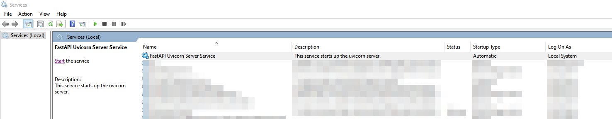
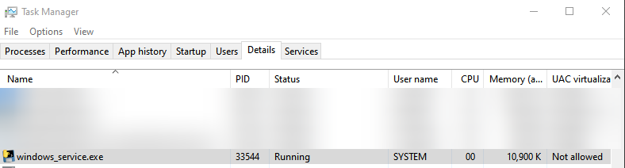
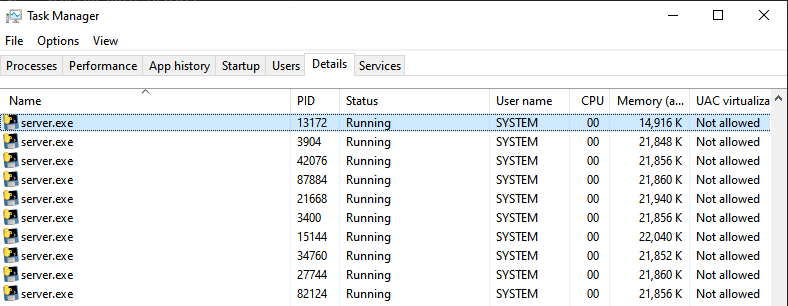
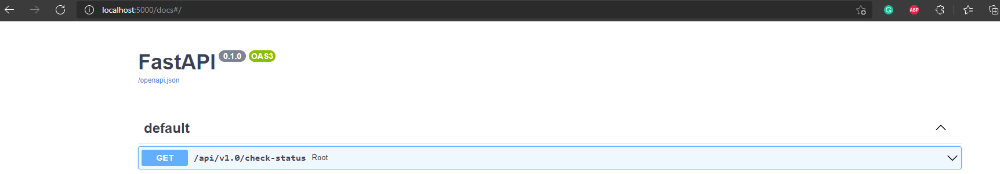
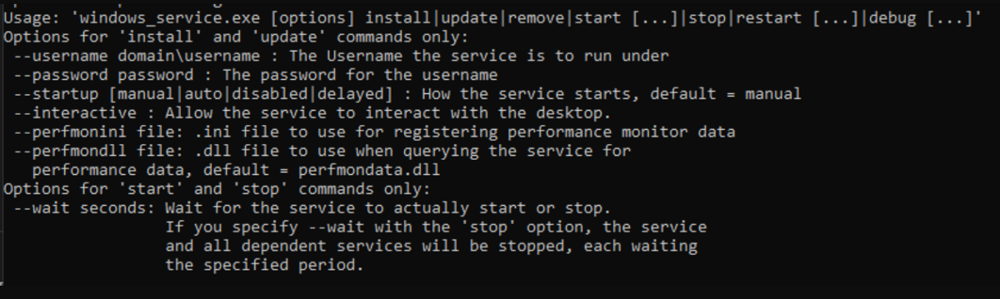

This repository is for creating a FastAPI/Uvicorn windows service.

Note: You need Miniconda3 or Anaconda3 installed on your system.

---
## Steps for installing the service
1. Clone this repo
2. From the root repo directory run create_windows_service_installer.bat
3. Move the dist/windows_service folder to install location. Note: Don't move the folder after this otherwise the service won't work.
4. Open elevated command prompt (i.e. as Admin)
5. cd to repo root directory
6. Type install_windows_service.bat and press enter

The service will be installed on your system in auto run mode.

You can start, stop, restart the service manually from the Services window.

Your service will be visible in the Task Manager details tab.

The Uvicorn server would be available at localhost:5000. 

You can check the API swagger at localhost:5000/docs.

The available CLI options for the windows service executable are shown below.

## Debugging

If for some reason you want to debug the server follow these steps:
1. Stop the FastAPI windows service
2. Run dist/windows_service/server/server.exe

You will be able to see logging values in the command prompt.
